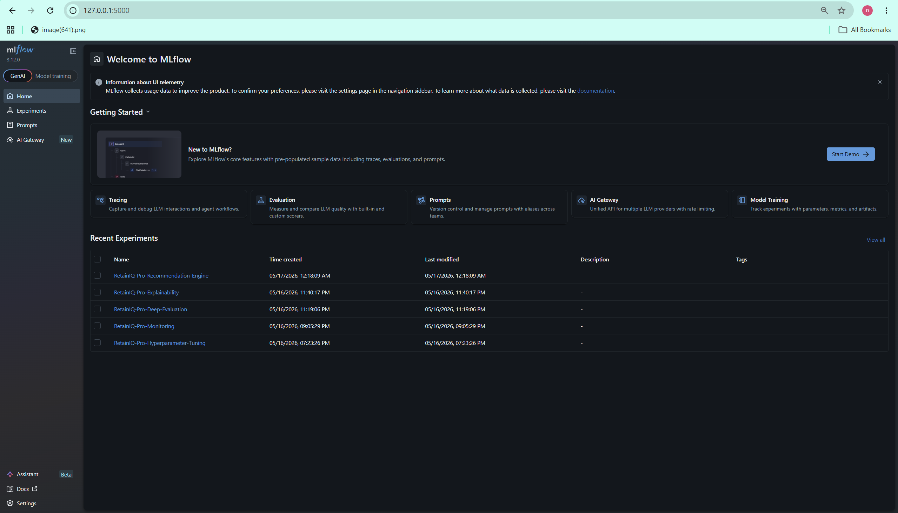
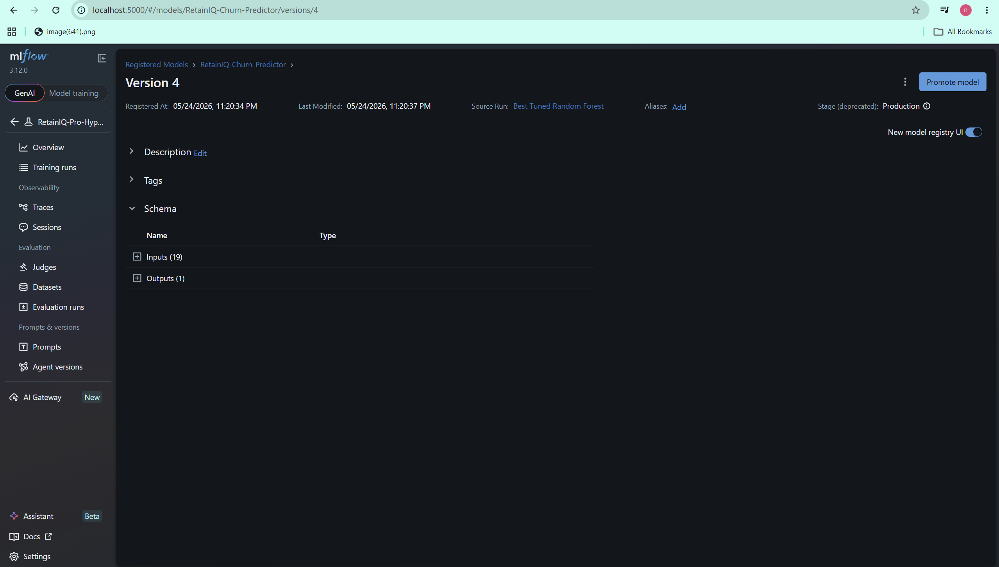
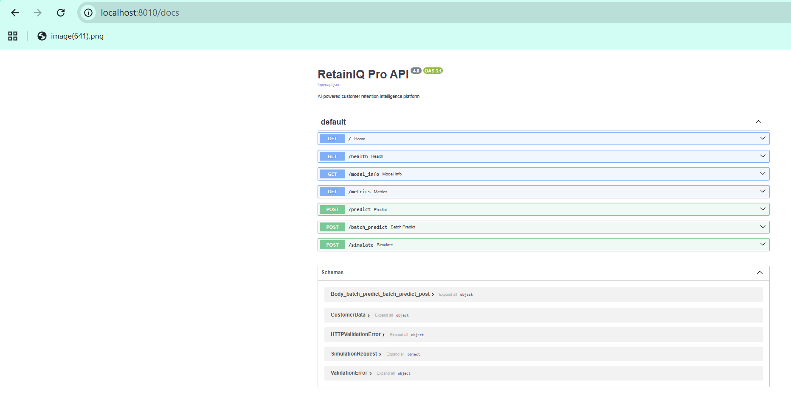
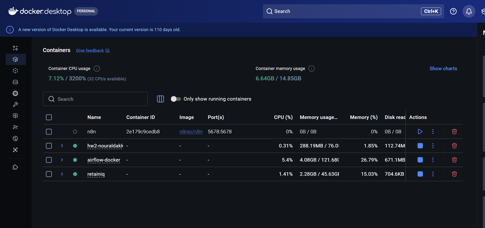

# RetainIQ Pro

AI-Powered Customer Churn Intelligence Platform with MLflow, FastAPI, Docker, and Explainable AI.

---

# Overview

RetainIQ Pro is an end-to-end machine learning lifecycle management platform developed to demonstrate practical MLOps concepts using MLflow.

The system predicts customer churn risk, explains why customers are likely to leave, and simulates retention strategies to estimate business impact.

The project focuses on the telecommunications and subscription business domain, where customer retention is critical for long-term revenue growth.

Using historical customer behavior data, the system applies machine learning models to identify high-risk customers and recommend potential retention actions.

The platform integrates:

- Experiment tracking
- Hyperparameter tuning
- Model registry management
- Real-time prediction APIs
- Batch prediction workflows
- MLflow monitoring
- Interactive business dashboard
- What-if retention simulation
- Dockerized deployment

The project demonstrates a complete production-style ML pipeline from model development to deployment and monitoring.

---

# Problem Statement

Customer churn is one of the biggest challenges faced by subscription-based companies.

Businesses often lose customers without understanding:

- Why customers leave
- Which customers are most at risk
- Which interventions are financially valuable
- How to manage machine learning models in production

Traditional reporting systems are reactive and fail to provide:

- Early churn prediction
- Explainable risk analysis
- Business-focused intervention simulations
- Centralized ML lifecycle management

RetainIQ Pro addresses these challenges by combining machine learning, explainability, and MLOps practices into a unified platform.

---

# Objectives

This project was developed to demonstrate the following machine learning lifecycle management objectives:

1. Experiment Tracking using MLflow
2. Model Training and Hyperparameter Tuning
3. Model Deployment using FastAPI
4. Performance Monitoring and Logging
5. Model Registry and Version Management
6. Interactive Prediction Dashboard
7. Explainable AI Workflows
8. What-If Retention Simulations
9. Dockerized Infrastructure

---

# System Architecture

```text
CSV Upload / API Request
            ↓
Frontend Dashboard
            ↓
FastAPI Backend Service
            ↓
ML Prediction Engine
(Random Forest Model)
            ↓
Predictions + Simulations
            ↓
MLflow Tracking & Registry
```

---

# Technologies Used

## Machine Learning

- Scikit-learn
- Pandas
- NumPy

## MLOps & Lifecycle Management

- MLflow
- Optuna
- Docker
- Docker Compose

## Backend

- FastAPI
- Uvicorn

## Frontend

- HTML
- CSS
- JavaScript

## Monitoring & Visualization

- MLflow UI
- Interactive Dashboard

---

# Domain and Dataset

## Domain

Telecommunications / Subscription Retention Analytics

## Dataset

Customer churn dataset containing:

- Customer demographics
- Subscription information
- Service usage patterns
- Contract details
- Billing behavior
- Payment methods

### Example Features

- Contract type
- Monthly charges
- Internet service
- Streaming services
- Online security
- Tenure
- Payment method
- Senior citizen status

### Target Variable

```text
Churn = Yes / No
```

---

# Machine Learning Workflow

## Step 1 — Data Preprocessing

- Missing value handling
- Categorical encoding
- Feature engineering
- Feature scaling
- Train-test split

---

## Step 2 — Model Training

Several machine learning models were evaluated.

### Final Selected Model

```text
Random Forest Classifier
```

### Reason for Selection

- Strong classification performance
- Stable probability predictions
- High interpretability support
- Reliable business simulation behavior

---

## Step 3 — Hyperparameter Optimization

Optuna was used to optimize model parameters automatically.

### Why Optuna Was Used

Although Hyperopt was originally considered, Optuna was selected because it is more actively maintained, easier to integrate with MLflow, and provides efficient Tree-structured Parzen Estimator (TPE) optimization.

### Tuned Parameters

```text
n_estimators
max_depth
min_samples_split
min_samples_leaf
class_weight
```

All tuning experiments were tracked inside MLflow.

---

## Step 4 — Experiment Tracking

MLflow tracks:

- Parameters
- Metrics
- Evaluation scores
- Artifacts
- Experiment runs

### Tracked Metrics

- Accuracy
- Precision
- Recall
- F1-score
- ROC-AUC

---

# MLflow Lifecycle Management

The project demonstrates practical usage of:

- MLflow Tracking
- MLflow Experiments
- MLflow Model Registry
- MLflow Metrics Logging
- MLflow Artifact Storage
- MLflow Model Versioning

---

# Model Registry

MLflow Model Registry is used to:

- Register trained models
- Version models
- Promote models to production
- Manage lifecycle stages

### Production Model

```text
RetainIQ-Churn-Predictor
```

### Production Loading Strategy

The FastAPI service attempts to load the production model directly from the MLflow Model Registry. If the registry is unavailable inside the Docker runtime, the API automatically falls back to the packaged production `.pkl` artifact to ensure prediction availability and service reliability.

---

# Real-Time Prediction API

FastAPI is used to deploy the trained model as a REST API service.

## Main Endpoints

```text
/predict
/simulate
/batch_predict
/metrics
/model_info
```

The API supports:

- Single customer predictions
- Batch CSV predictions
- Retention simulations
- Monitoring metrics

---

# Explainable Risk Intelligence

The system generates model-based explanations for churn predictions.

## Example Explanation

```text
Changing contract from Month-to-month to One year
reduces predicted churn risk by 32%.
```

This allows businesses to understand actionable retention strategies rather than only receiving raw predictions.

---

# What-If Retention Simulator

The platform includes a business simulation engine that estimates:

- Risk reduction
- Revenue protected
- Intervention cost
- ROI of retention actions

## Example Simulation

```text
Current Risk: 92%
After One-Year Contract: 57%
Risk Reduction: 35%
Estimated Revenue Protected: $354.55
```

---

# Interactive Dashboard

The dashboard provides:

- CSV upload interface
- Churn analysis summary
- High-risk customer ranking
- Simulation results
- Revenue exposure estimation
- Live API metrics
- Production monitoring view

---

# Monitoring Features

The system tracks:

- Total predictions served
- High-risk prediction frequency
- Batch inference size
- Simulation usage
- Prediction timestamps

Additional drift monitoring scripts simulate production drift windows and evaluate feature distribution changes across time periods.

---

# Dockerized Infrastructure

The project is fully containerized using Docker and Docker Compose.

Docker provides:

- Reproducible environments
- Simplified deployment
- Dependency management
- Portable execution

---

# Docker Compose Architecture

The system is deployed using Docker Compose with three containers:

| Container | Purpose |
|---|---|
| retainiq-frontend | Interactive dashboard interface |
| retainiq-api | FastAPI prediction service |
| retainiq-mlflow | MLflow experiment tracking server |

Docker Compose allows the complete platform to run using a single command:

```bash
docker compose up --build
```

---

# Project Structure

```text
RetainIQ/
│
├── api/
│   └── main.py
│
├── frontend/
│   ├── index.html
│   ├── styles.css
│   ├── app.js
│   ├── Dockerfile
│   └── assets/
│
├── data/
│   ├── raw/
│   │   └── telco_churn.csv
│   │
│   ├── processed/
│   │   └── telco_churn_clean.csv
│   │
│   └── production_simulation/
│       ├── production_customers.csv
│       ├── production_window_1.csv
│       ├── production_window_2.csv
│       ├── production_window_3.csv
│       └── simulated_production_data.csv
│
├── models/
│   ├── best_tuned_churn_model.pkl
│   └── preprocessor.pkl
│
├── src/
│   ├── registry.py
│   ├── train.py
│   ├── tune.py
│   ├── monitoring.py
│   ├── evaluate.py
│   ├── explain.py
│   ├── recommendations.py
│   └── drift_monitoring.py
│
├── reports/
│   ├── drift/
│   ├── recommendations/
│   ├── explainability/
│   ├── evaluation/
│   ├── monitoring/
│   ├── tuning/
│   └── training_artifacts/
│
├── docs/
│   └── screenshots/
│       ├── dashboard_overview.png
│       ├── risk_analysis_dashboard.png
│       ├── mlflow_home.png
│       ├── mlflow_run_details.png
│       ├── mlflow_model_registry.png
│       ├── api_documentation.png
│       ├── api_predict_endpoint.png
│       ├── api_simulation_endpoint.png
│       └── docker_containers_running.png
│
├── mlruns/
├── notebooks/
│   └── EDA_MLOPS.ipynb
│
├── sample_customers.csv
├── docker-compose.yml
├── Dockerfile
├── requirements.txt
├── README.md
├── .gitignore
└── .dockerignore
```

---

# Screenshots

## Dashboard


---

## MLflow Tracking





---

## API Documentation



---

## Docker Containers



---

# Results

## Final Model Performance

| Metric | Score |
|---|---|
| Accuracy | 0.84 |
| Precision | 0.79 |
| Recall | 0.76 |
| F1-Score | 0.77 |
| ROC-AUC | 0.88 |

The tuned Random Forest model achieved strong predictive performance and balanced recall/precision tradeoffs suitable for churn-risk detection.

The final Random Forest model successfully demonstrated:

- End-to-end ML lifecycle management
- Model deployment
- Experiment tracking
- Hyperparameter tuning
- Real-time prediction serving
- Explainable retention analysis
- Business-oriented simulation workflows

---

# Future Improvements

Potential future enhancements include:

- Real-time streaming predictions
- Cloud deployment
- Automated retraining pipelines
- SHAP-based explainability
- Advanced drift detection
- LLM-generated customer insights
- Kubernetes deployment
- CI/CD integration

---

# Lessons Learned

This project demonstrated the importance of combining machine learning engineering with operational lifecycle management. Beyond model accuracy, production systems require deployment reliability, experiment traceability, explainability, monitoring, and reproducible infrastructure.

The project also highlighted how MLOps practices improve collaboration, reproducibility, and maintainability in real-world AI systems.

---

# Conclusion

RetainIQ Pro demonstrates a complete MLOps-oriented machine learning system using MLflow and FastAPI.

The project combines:

- Predictive analytics
- Explainability
- Model deployment
- Monitoring
- Business simulation
- Lifecycle management

into a unified production-style platform.

The system not only predicts churn but also provides actionable business insights and retention strategy simulations.

---

# Prerequisites

Before running the project, ensure the following tools are installed:

- Python 3.11+
- Docker Desktop
- Git

Recommended environment:

- Windows 10/11
- VS Code
- PowerShell

---

# Verify Docker Installation

```bash
docker --version
docker compose version
```

---

# How to Run

## 1. Clone Repository

```bash
git clone <your-repository-url>
cd RetainIQ
```

---

## 2. Build and Run Containers

```bash
docker compose up --build
```

---

## 3. Open Services

### Frontend Dashboard

```text
http://localhost:5511
```

### FastAPI Documentation

```text
http://localhost:8010/docs
```

### MLflow UI

```text
http://localhost:5000
```

---

# Alternative Local Execution (Without Docker)

## Install Dependencies

```bash
pip install -r requirements.txt
```

---

## Run FastAPI Backend

```bash
uvicorn api.main:app --reload --port 8010
```

---

## Run Frontend

```bash
cd frontend
python -m http.server 5510
```

---

## Run MLflow

```bash
mlflow ui
```

---

# Docker Verification

After running Docker Compose, verify the following:

## Frontend

```text
http://localhost:5511
```

The dashboard should display:

- Customer analysis
- High-risk customer table
- What-if simulation
- Monitoring metrics

## API

```text
http://localhost:8010/docs
```

Swagger UI should display all endpoints.

## MLflow

```text
http://localhost:5000
```

MLflow UI should display:

- Experiments
- Runs
- Metrics
- Registered models
- Artifacts

